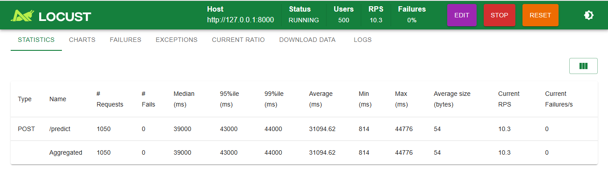

# Customer Churn - Projeto de MLOps #

Este projeto utiliza Redes Neurais para prever a probabilidade de rotatividade de clientes, integrando ferramentas de MLOps para garantir o rastreamento, reprodutibilidade e versionamento do modelo.

**Responsável**: Andresa Araújo

 **Objetivo**: Desenvolver um modelo capaz de identificar clientes com alto risco de cancelamento, permitindo que a equipe de retenção tome medidas proativas.

 **Status:** Concluído / Validado em ambiente local

## Tecnologias e Ferramentas
Linguagem: Python 3.10+

Deep Learning: TensorFlow / Keras

Rastreamento de Experimentos: MLflow

Infraestrutura MLOps: DagsHub

Ambiente: Conda / Anaconda

Controle de Versão: Git / GitHub

Containerização: Docker 

Testes de Performance: Locust (validação de carga e latência).

Automação (CI/CD): GitHub Actions (pipeline automatizado via YAML).

Monitoramento de Dados: KS-Test (Kolmogorov-Smirnov) para detecção manual de Data Drift.

Pré-processamento: Scikit-Learn (Pipelines e Scalers serializados).

## Estrutura do Repositório

src/: Scripts de treinamento e predição.

data/: Dataset utilizado (Customer-Churn-Records.csv).

docs/: Documentação visual e prints de validação

Dockerfile: Configuração da imagem para deploy.

locustfile.py: Script de teste de estresse da API.

scaler.pkl: Objeto de normalização dos dados para inferência.

workflow/: Definições do pipeline de CI/CD.

environment.yml: Configuração do ambiente Conda.

requirements.txt: Dependências do Python via Pip.

## Validação e Qualidade (QA)

**Teste de Carga (Locust)**

A API foi submetida a um teste de estresse simulando 500 usuários simultâneos requisitando o endpoint /predict.

Resultado: 0% de falhas.

Performance: A aplicação manteve-se resiliente sob alta carga, validando a robustez da containerização.

Abaixo, o resultado do teste de carga realizado com o Locust, validando a estabilidade da API com 500 usuários simultâneos e 0% de falhas:

**Detecção de Data Drift**

Devido à necessidade de um monitoramento leve e direto, foi implementado o Teste Kolmogorov-Smirnov (KS) manual. Objetivo: Comparar a distribuição dos dados de treino vs. dados reais.

Conclusão: O modelo foi validado para garantir que as previsões continuem precisas mesmo com mudanças nas variáveis de entrada (p-value > 0.05).

## Ficha Técnica do Modelo
Algoritmo: Rede Neural Sequencial (Multilayer Perceptron).

Arquitetura: Entrada (16) -> Ocultas (10, 10) -> Saída (Sigmoid).

Métrica Final (Acurácia): ~86%

Dataset: 10.000 registros com 18 variáveis originais.

## Experimentos e Artefatos
As métricas detalhadas e as versões do modelo podem ser consultadas no meu painel do [DagsHub](https://dagshub.com/andresakmr/customer_churn_mlops/models)
